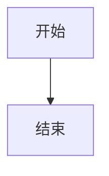
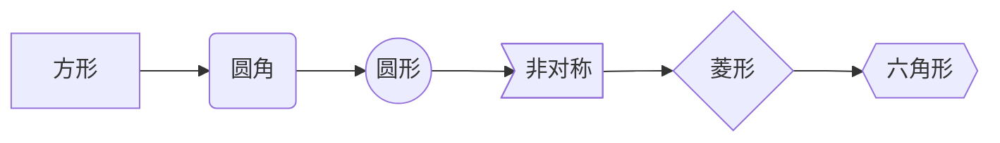
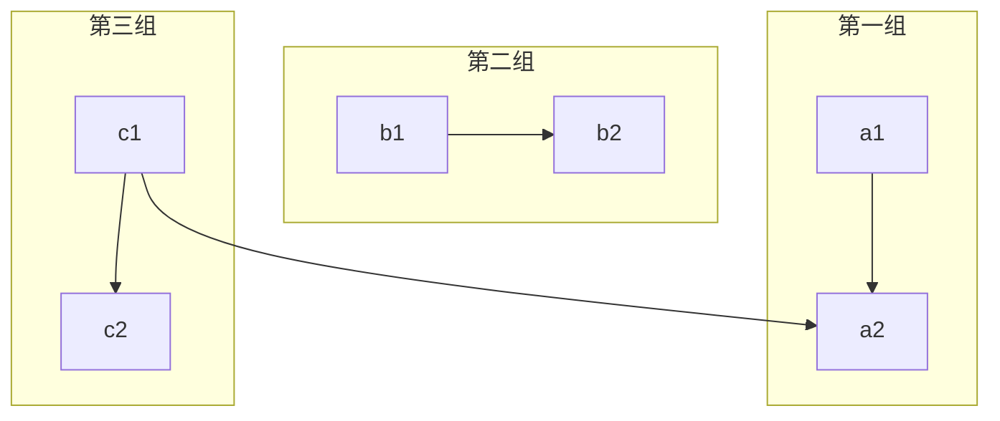
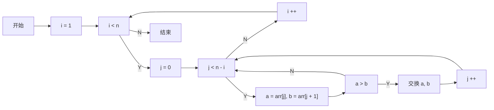

> 本文由 [简悦 SimpRead](http://ksria.com/simpread/) 转码， 原文地址 [www.jianshu.com](https://www.jianshu.com/p/7864c1cf5660)

流程图语法
-----

### 1、创建流程图模块

语法如下：

```
  ```mermaid


```

### 2、流程图方向

<table><thead><tr><th>标志</th><th>方向</th></tr></thead><tbody><tr><td>TB</td><td>top bottom - 从上到下</td></tr><tr><td>BT</td><td>bottom top - 从下到上</td></tr><tr><td>RL</td><td>right left - 从右到左</td></tr><tr><td>LR</td><td>left right - 从左到右</td></tr><tr><td>TD</td><td>等同于 TB</td></tr></tbody></table>

创建一个从上到下流程图语法如下：

```



### 3、流程块形状样式

```



```


### 4、连接线样式

> 样式的含义：
> 
> *   有箭头：一般指数据流方向
> *   无箭头：仅表示相关性
> *   实线：强关联
> *   虚线：弱关联

#### 4.1、箭头样式

```


#### 4.2、无向线段连接线

```


#### 4.3、点状链接线（虚线）

```


#### 4.4、加粗线条

```


### 5、分组

```



6、实例
----

```


